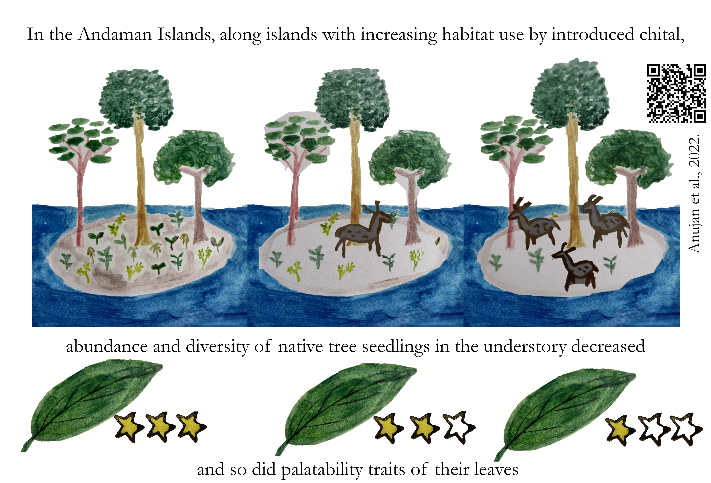
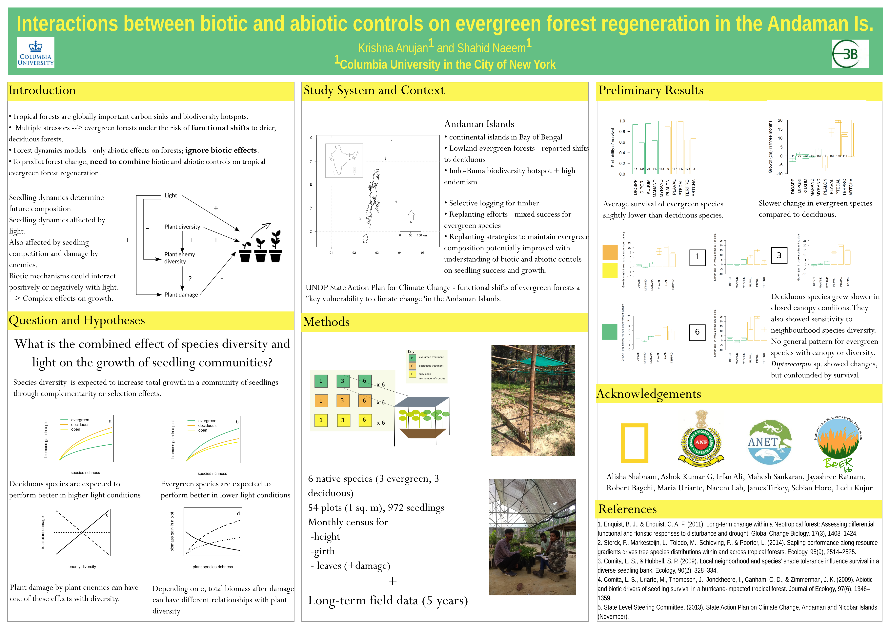
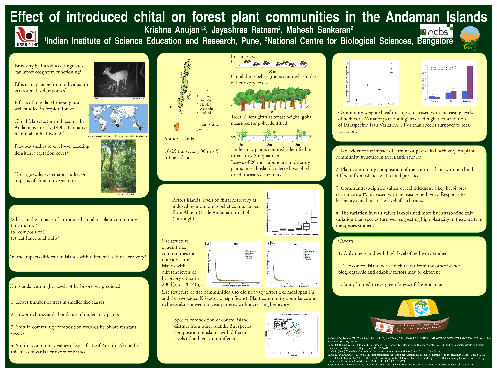

## Published peer-reviewed manuscripts
1. [@anujan_drought_inpress]
1. [@anujan_biodiversity_2025]  
1. [@higino_designing_2025] ***shared first authorship*** 
1. [@anujan_metropolis_2024]
2. [@anujan_chronic_2022]
5. [@mohanty_diet_2022]
3. [@anujan_trophic_2021]
4. [@heilpern_positive_2020]
6. [@sridharan_violet_2017]

## Preprints in review
1. [@anujan_longterm_inrevision]
2. [@anujan_harmonising_inreview]  
 
## Posters and graphical abstracts

:::: {.grid}

:::: {.g-col-12 .g-col-md-4}
Anujan, K., McMahon, S. M., Bunyavejchewin, S., Davies, S. J., Pongpattananurak, N., Muller-Landau, H. C., & Anderson-Teixeira, K. J.,Sensitivity of tree growth to precipitation in seasonally dry tropical forests using long-term dendrometer band measurements. ***Annual Meeting of the American Geophysical Union 2024***
:::
:::: {.g-col-12 .g-col-md-8}
{.img-fluid}
:::

::: {.g-col-12 .g-col-md-4}
Anujan K., Ratnam J., and Sankaran M. (2022) Chronic browsing by an introduced herbivore in a tropical island alters composition and functional traits of forest understories, Biotropica. DOI: 10.1111/btp.13149
:::
::: {.g-col-12 .g-col-md-8}
{.img-fluid}
:::

::: {.g-col-12 .g-col-md-4}
Anujan K and Naeem S, Interactions between biotic and abiotic controls on evergreen forest regeneration in the Andaman Islands.
***Annual Meeting of the Association of Tropical Biology and Conservation, Antananarivo, Madagascar, 2019***
:::
::: {.g-col-12 .g-col-md-8}
{.img-fluid}
:::

::: {.g-col-12 .g-col-md-4}
Anujan K, Heilpern SA, Prager CM, Bruner SG, Lipton S and Naeem S, Trophic complexity alters the diversity-multifunctionality effect in experimental grassland mesocosms. ***Ecological Society of America Annual Meeting, 2018***
:::
::: {.g-col-12 .g-col-md-8}
{.img-fluid}
:::

::: {.g-col-12 .g-col-md-4}
Anujan K, Ratnam J and Sankaran M, 2016. Effect of introduced chital on forest plant communities in the Andaman Islands. ***National Centre for Biological Sciences Annual Talks 2016***
:::
::: {.g-col-12 .g-col-md-8}
{.img-fluid}
:::

::: {.g-col-12 .g-col-md-4}
Anujan K, Ratnam J and Sankaran M, 2015. Effect of introduced chital on forest plant communities in the Andaman Islands. ***Student Conference for Conservation Sciences, Bangalore, 2015. Best Poster Award***
:::
::: {.g-col-12 .g-col-md-8}
{.img-fluid}
:::